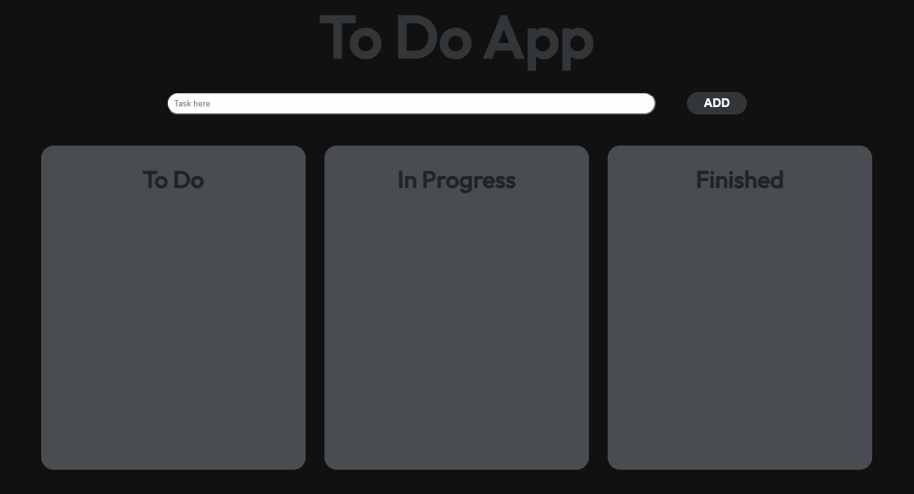

# To-Do-D-D
To-Do app with drag and drop

# Pomodoro-App

This is a to-do with drag and drop, where you can create tasks, mark them, move them to different states and delete them.

## Table of contents

- [Overview](#overview)
  - [Screenshot](#screenshot)
  - [Built with](#built-with)
- [Author](#author)

## Overview

Link to the app: https://wonderful-babka-974508.netlify.app/

### Screenshot

### Built with

- Semantic HTML5 markup
- CSS custom properties
- Flexbox
- JavaScript
## Author

- TikTok - [@elrincondeldev](https://www.tiktok.com/@elrincondeldev)
- Instagram - [@elrincondeldev](https://www.instagram.com/elrincondeldev/)